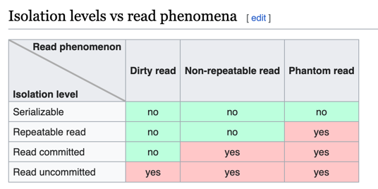

### Database Transaction Isolation Levels

### Isolation Levels
- Read Uncommitted
- Read Committed
- Repeatable Read
- Serializable
  - Optimistic
    - SSI
      - Read Serialization Isolation
      - Write Serialization Isolation
    - Timestamp Ordering
      - Basic TO
      - SILO
      - TicToc
  - Pessimistic
    - 2PL + Percolator

### Diagrams

Ref: [Wiki](https://en.wikipedia.org/wiki/Isolation_%28database_systems%29#Isolation_levels_vs_read_phenomena)